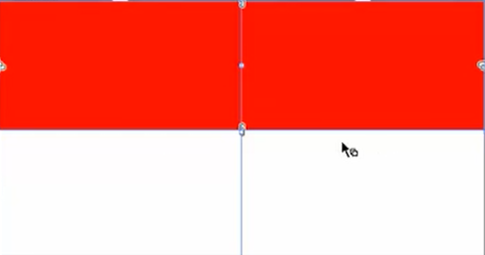
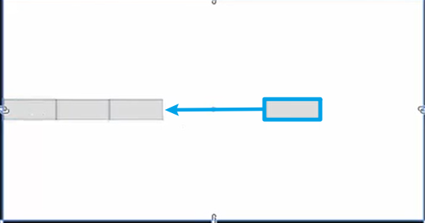
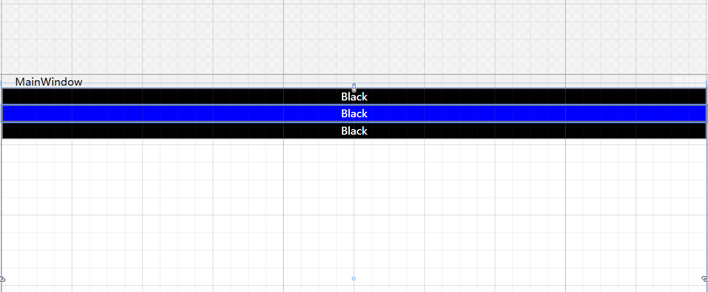
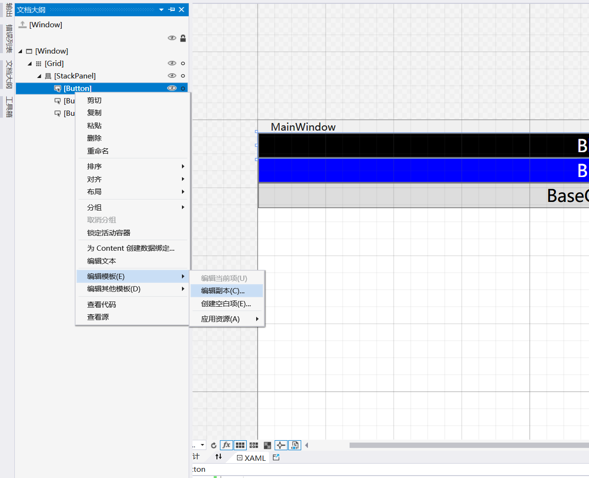
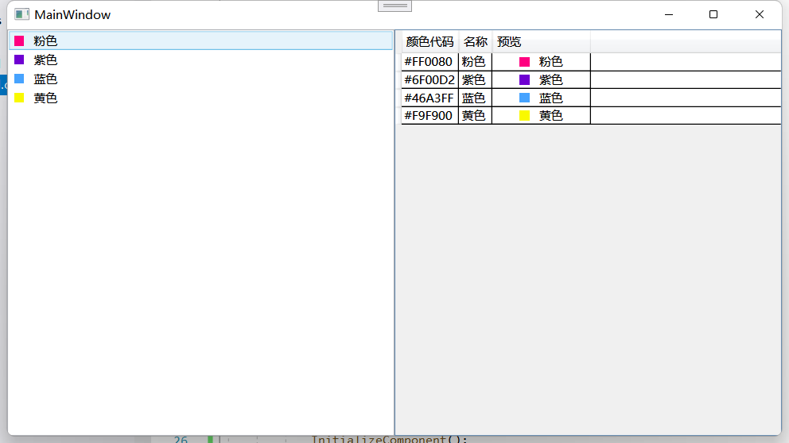
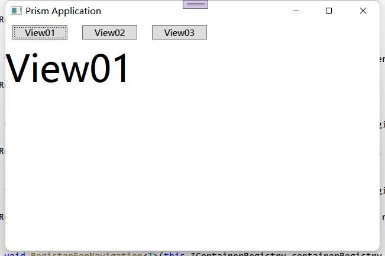

## 布局基础: Container

> ### Grid

```xaml
//定义行列
<Grid>
    <Grid.RowDefintions>	
    	<RowDefintion Height="auto"/>
    	<RowDefintion />
    </Grid.RowDefintions>
	<Grid.ColumnDefinitions>	
    	<ColumnDefintion />
    	<ColumnDefintion />
    </Grid.ColumnDefinitions>
</Grid>

<Border Background="Red" Grid.ColumnSpan="2" />
```

`Height="auto"	//高度跟随内容变化(宽度相同)`

`Height="2*"		//两倍高度`

`Grid.ColumnSpan="2"	//占两列`

`Grid.RowSpan="2"	//占两行`



> ### StackPanel

#### 是一个局部容器，一般用于部分控件的元素排布

##### <span style="color:red">不会自动换行</span>

`Orientation="Horizontal"`	//从左往右水平排列

`Vertical`	//从上至下垂直排列

> ### WrapPanel

#### 默认水平排列，<span style="color:red">一行放不下会自动换行</span>

也可修改`Orientation`属性调整排列方式

> ### DockPanel

#### 自动停靠

```xaml
<DockPanel LastChildFill="False">
	<Button Width="100" Height="50" DockPanel.Dock="Left" />
	<Button Width="100" Height="50" DockPanel.Dock="Right" />
	<Button Width="100" Height="50" DockPanel.Dock="Top" />
	<Button Width="100" Height="50" DockPanel.Dock="Buttom" />
</DockPanel>
```

`LastChildFill="False"`	//最后一个元素是否填充满

设为`true`则移动到第三个元素后面



`DockPanel.Dock`	//设置上下左右四个方向

> ### UniformGrid

```xaml
<UniformGrid Columns="3" Rows="3">
	<Button />
	<Button />
	<Button />
	<Button />
	<Button />
	<Button />
	<Button />
	<Button />
	<Button />
</UniformGrid>
```

#### 定义了三行三列，在有限的空间内均分剩余的空间

##### 也可以不用定义行列，根据内部控件会自动分配


## 样式基础: Style

```xaml
<Window.Resources>
        <Style x:Key="BaseButtonStyle" TargetType="Button">
            <Setter Property="FontSize" Value="20"/>
            <Setter Property="Content" Value="BaseContent"/>
        </Style>
        <Style x:Key="ButtonStyle" TargetType="Button" BasedOn="{StaticResource BaseButtonStyle}">
            <Setter Property="Foreground" Value="White"/>
            <Setter Property="Background" Value="Black"/>
            <Setter Property="Content" Value="Black"/>
        </Style>
    </Window.Resources>
    <Grid>
        <StackPanel>
            <Button Style="{StaticResource ButtonStyle}" />
            <Button Style="{StaticResource ButtonStyle}" Background="Blue" />
            <Button Style="{StaticResource BaseButtonStyle}" />
        </StackPanel>
    </Grid>
```

##### `TargetType`设置样式指向的控件类型，<span style="color:red">使用时要确保类型一致</span>

##### `Setter`中设置`Property`控件属性，`Value`控件属性的值

##### 写在控件上的样式优先级最高，类似CSS

##### 也可以给样式设置`x:Key`，使用时在控件上设置`Style="{StaticResource x:key}"`

> ### 样式继承

`BaseOn`: 继承与于其他样式，常将通用的样式写在基础样式中

最终效果



## 控件模板: ControlTemplate

##### 在文档大纲中可以看到控件，右键进入到编辑副本



`TemplateBinding`:	属性在控件和模板中作桥接

`ContentPresenter`: 	Content的内容，如果没有它控件里就什么都看不到了

```xaml
<Window.Resources>
        <Style x:Key="BaseButtonStyle" TargetType="Button">
            <Setter Property="FontSize" Value="20"/>
            <Setter Property="Content" Value="BaseContent"/>
        </Style>
        <Style x:Key="ButtonStyle" TargetType="Button" BasedOn="{StaticResource BaseButtonStyle}">
            <Setter Property="Foreground" Value="White"/>
            <Setter Property="Background" Value="Black"/>
            <Setter Property="Content" Value="Black"/>
        </Style>
        <SolidColorBrush x:Key="Button.MouseOver.Background" Color="#FFBEE6FD"/>
        <SolidColorBrush x:Key="Button.MouseOver.Border" Color="#FF3C7FB1"/>
        <SolidColorBrush x:Key="Button.Pressed.Background" Color="#FFC4E5F6"/>
        <SolidColorBrush x:Key="Button.Pressed.Border" Color="#FF2C628B"/>
        <SolidColorBrush x:Key="Button.Disabled.Background" Color="#FFF4F4F4"/>
        <SolidColorBrush x:Key="Button.Disabled.Border" Color="#FFADB2B5"/>
        <SolidColorBrush x:Key="Button.Disabled.Foreground" Color="#FF838383"/>
        <ControlTemplate x:Key="ButtonTemplate1" TargetType="{x:Type ButtonBase}">
            <Border x:Name="border" 
                    <!Background="{TemplateBinding Background}">
                    BorderThickness="{TemplateBinding BorderThickness}" 
                    BorderBrush="{TemplateBinding BorderBrush}" 
                    SnapsToDevicePixels="true"
            >
                <ContentPresenter x:Name="contentPresenter" Focusable="False" HorizontalAlignment="{TemplateBinding HorizontalContentAlignment}" Margin="{TemplateBinding Padding}" RecognizesAccessKey="True" SnapsToDevicePixels="{TemplateBinding SnapsToDevicePixels}" VerticalAlignment="{TemplateBinding VerticalContentAlignment}"/>
            </Border>
            <ControlTemplate.Triggers>
                <Trigger Property="Button.IsDefaulted" Value="true">
                    <Setter Property="BorderBrush" TargetName="border" Value="{DynamicResource {x:Static SystemColors.HighlightBrushKey}}"/>
                </Trigger>
                <Trigger Property="IsMouseOver" Value="true">
                    <Setter Property="Background" TargetName="border" Value="{StaticResource Button.MouseOver.Background}"/>
                    <Setter Property="BorderBrush" TargetName="border" Value="{StaticResource Button.MouseOver.Border}"/>
                </Trigger>
                <Trigger Property="IsPressed" Value="true">
                    <Setter Property="Background" TargetName="border" Value="{StaticResource Button.Pressed.Background}"/>
                    <Setter Property="BorderBrush" TargetName="border" Value="{StaticResource Button.Pressed.Border}"/>
                </Trigger>
                <Trigger Property="IsEnabled" Value="false">
                    <Setter Property="Background" TargetName="border" Value="{StaticResource Button.Disabled.Background}"/>
                    <Setter Property="BorderBrush" TargetName="border" Value="{StaticResource Button.Disabled.Border}"/>
                    <Setter Property="TextElement.Foreground" TargetName="contentPresenter" Value="{StaticResource Button.Disabled.Foreground}"/>
                </Trigger>
            </ControlTemplate.Triggers>
        </ControlTemplate>
    </Window.Resources>
    <Grid>
        <StackPanel>
            <Button Template="{DynamicResource ButtonTemplate1}" Style="{StaticResource ButtonStyle}" Background="Red" />
            <Button Style="{StaticResource ButtonStyle}" Background="Blue" />
            <Button Style="{StaticResource BaseButtonStyle}" />
        </StackPanel>
    </Grid>
```

当注释掉`Background="{TemplateBinding Background}" `时，颜色就消失了，并且在控件中加上Background属性也没有颜色了

## 数据模板: DataTemplate

#### 重点:	用数据驱动UI的显示

在`DataTemplate`中编写UI，再通过`Binding`绑定数据

```xaml
<Grid>
    <Grid.ColumnDefinitions>
        <ColumnDefinition/>
        <ColumnDefinition/>
    </Grid.ColumnDefinitions>
    <ListBox x:Name="list">
        <ListBox.ItemTemplate>
            <DataTemplate>
                <StackPanel Orientation="Horizontal">
                    <Border Background="{Binding Code}" Width="10" Height="10" />
                    <TextBlock Margin="10,0,0,0" Text="{Binding Name}" />
                </StackPanel>
            </DataTemplate>
        </ListBox.ItemTemplate>
    </ListBox>
    <DataGrid Grid.Column="1" x:Name="gird" AutoGenerateColumns="False" CanUserAddRows="False" >
        <DataGrid.Columns>
            <DataGridTextColumn Binding="{Binding Code}" Header="颜色代码"></DataGridTextColumn>
            <DataGridTextColumn Binding="{Binding Name}" Header="名称"></DataGridTextColumn>
            <DataGridTemplateColumn Header="预览" Width="100">
                <DataGridTemplateColumn.CellTemplate>
                    <DataTemplate>
                        <StackPanel Orientation="Horizontal" HorizontalAlignment="Center">
                            <Border Background="{Binding Code}" Width="10" Height="10" />
                            <TextBlock Margin="10,0,0,0" Text="{Binding Name}" />
                        </StackPanel>
                    </DataTemplate>
                </DataGridTemplateColumn.CellTemplate>
            </DataGridTemplateColumn>
        </DataGrid.Columns>
    </DataGrid>
</Grid>
```

```C#
public partial class MainWindow : Window
{
    public List<MyColor> MyColorList { get; set; }
    public MainWindow()
    {
        InitializeComponent();
        List<MyColor> MyColorList = new List<MyColor>();
        MyColorList.Add(new MyColor { Code = "#FF0080", Name = "粉色" });
        MyColorList.Add(new MyColor { Code = "#6F00D2", Name = "紫色" });
        MyColorList.Add(new MyColor { Code = "#46A3FF", Name = "蓝色" });
        MyColorList.Add(new MyColor { Code = "#F9F900", Name = "黄色" });
        list.ItemsSource = MyColorList;
        gird.ItemsSource = MyColorList;
    }
}

public class MyColor
{
    public string Code { get; set; }
    public string Name { get; set; }
}
```

##### 最终效果



## 绑定: Binding

#### <span style="color:red">用事件驱动显得特别啰嗦</span>

```xaml
<Window.Resources>
        <Style x:Key="MyTxtBoxStyle" TargetType="TextBox">
            <Setter Property="Height" Value="20"/>
            <Setter Property="Margin" Value="0,5,0,0"/>
        </Style>
    </Window.Resources>
    <Grid>
        <StackPanel>
            <Slider x:Name="slider" />
            <TextBox Text="{Binding ElementName=slider,Path=Value,Mode=OneTime}" Style="{StaticResource MyTxtBoxStyle}"/>
            <TextBox Style="{StaticResource MyTxtBoxStyle}"/>
            <TextBox Style="{StaticResource MyTxtBoxStyle}"/>
        </StackPanel>
    </Grid>
```

#### 控件与控件的绑定

```xaml
{Binding ElementName=slider,Path=Value,Mode=OneTime}
```

`ElementName`: 表示要绑定的控件的名称

`Path`: 表示要绑定的属性

`Mode`: 表示绑定的模式

1. `OneTime`: 只绑定一次
2. `OneWay`: 单向绑定
3. `OneWayToSource`: 改变了绑定的方向
4. `TwoWay`: 双向绑定


#### UI与业务的绑定

##### 通过`DataContext`获取数据并绑定到UI

```xaml
<TextBlock Text="{Binding Name}"></TextBlock>
<TextBlock Text="{Binding Age}"></TextBlock>
```

```c#
public partial class MainWindow : Window
{
    public MainWindow()
    {
        InitializeComponent();
        this.DataContext = new TestBinding
        {
            Name = "卓越",
            Age = 23
        };
    }
}

public class TestBinding
{
    public string Name { get; set; }
    public int Age { get; set; }
}
```

## 命令: Command

#### 事件驱动: 

```xaml
<Button Click="Button_Click" />
```

```C#
public void Button_Click(object sender, RoutedEventArgs e){
    MessageBox.Show("你点了按钮");
}
```

#### 命令驱动: 

```xaml
<Button Command="{Binding ClickCommand}" Content="点击" Width="100" Height="20"/>
```

##### 创建一个视图模型类

```C#
public class VM_MainWindow
{
    public BaseCommand ClickCommand
    {
        get
        {
            return new BaseCommand(() =>
            {
                MessageBox.Show("你点击了按钮");
            });
        }
    }
}

public class BaseCommand : ICommand
{
    Action action { get; set; }

    public BaseCommand(Action _action)
    {
        this.action = _action;
    }

    public event EventHandler CanExecuteChanged;

    public bool CanExecute(object parameter)
    {
        return true;
    }

    public void Execute(object parameter)
    {
        action();
    }
}
```

##### 此时控件上只需要绑定一个命令即可

```c#
public MainWindow()
{
    InitializeComponent();
    //需要指定一下数据上下文
    this.DataContext = new VM_MainWindow();
}
```

##### 

## 属性更改: INotifyPropertyChanged

```C#
/// <summary>
/// author: zy
/// datetime: 
/// des: 监听属性变化，每个ViewModel都要继承INotifyPropertyChanged的话太麻烦了
/// </summary>
public class ViewModelBase : INotifyPropertyChanged
{
    public event PropertyChangedEventHandler PropertyChanged;

    public void OnPropertyChanged([CallerMemberName] string propertyName = "")
    {
        this.PropertyChanged.Invoke(this, new PropertyChangedEventArgs(propertyName));
    }
}
```

#### ViewModel中的属性在set时需要调用父类的监听方法

```C#
public class VM_MainWindow : ViewModelBase
{
    private string name;

    public string Name
    {
        get { return name; }
        set
        {
            name = value;
            OnPropertyChanged();
        }
    }
    public VM_MainWindow()
    {
        this.name = "你好，请点我";
    }
    public BaseCommand ClickCommand
    {
        get
        {
            return new BaseCommand(Show);
        }
    }

    private void Show()
    {
        this.Name = "你点了我";
        MessageBox.Show(this.Name);
    }
}
```

### 扩展特性

1. `CallerMemberName`：调用某个方法的主方法名称
2. `CallerFilePath`：调用某个方法的主方法所在的类文件地址
3. `CallerLineNumber`：调用这个方法所在的行号

```C#
using System;
using System.Runtime.CompilerServices;

namespace Ceshi
{
    class Program
    {
        static void Main(string[] args)
        {
            //直接调用
            DirectProcessing("*******直接调用********");
            //间接调用
            InirectProcessing();
        }

        public static void InirectProcessing()
        {
            DirectProcessing("********间接调用*********");
        }

        public static void DirectProcessing(string message,
        [CallerMemberName] string memberName = "",
        [CallerFilePath] string sourceFilePath = "",
        [CallerLineNumber] int sourceLineNumber = 0)
        {
            Console.WriteLine("信息为: " + message);
            Console.WriteLine("方法名称: " + memberName);
            Console.WriteLine("源文件地址: " + sourceFilePath);
            Console.WriteLine("方法使用所在行号: " + sourceLineNumber);
        }
    } 
}


```

[代码转载自CSDN - [黑夜de骑士]](https://blog.csdn.net/birdfly2015/article/details/106628138)

## 资源基础: Resource

### 静态资源和动态资源

##### `StaticResource`: 读取一次以后就不会再变化了

##### `DynamicResource`: 可以在程序运行时更新资源

##### 如果资源会常发生变化则使用动态资源

```xaml
<Grid>
    <StackPanel>
        <Button BorderBrush="{StaticResource SolidColor}" Margin="10" Content="静态资源" BorderThickness="2"/>
        <Button BorderBrush="{DynamicResource SolidColor}" Click="Button_Click" Margin="10" Content="动态资源" BorderThickness="2"/>
    </StackPanel>
</Grid>
```

```C#
public partial class MainWindow : Window
{
    public MainWindow()
    {
        InitializeComponent();
    }

    private void Button_Click(object sender, RoutedEventArgs e)
    {
        this.Resources["SolidColor"] = new SolidColorBrush(Colors.Red);
    }
}
```

##### 点击动态资源按钮后修改资源


### 资源字典

##### 新建一个资源字典ButtonStyle.xaml


```xaml
<ResourceDictionary xmlns="http://schemas.microsoft.com/winfx/2006/xaml/presentation"
                    xmlns:x="http://schemas.microsoft.com/winfx/2006/xaml">
    <SolidColorBrush x:Key="SolidColor" Color="Blue"/>
    <Style x:Key="DefaultButtonStyle" TargetType="Button">
        <Setter Property="Background" Value="#0075D0" />
        <Setter Property="FontSize" Value="15" />
        <Setter Property="Foreground" Value="White" />
    </Style>
</ResourceDictionary>
```

##### 就跟CSS一模一样，在`Application.Resource`中引用后界面中就可以直接使用了

```xaml
<Application.Resources>
    <ResourceDictionary>
        <ResourceDictionary.MergedDictionaries>
            <ResourceDictionary Source="ButtonStyle.xaml"/>
        </ResourceDictionary.MergedDictionaries>
    </ResourceDictionary>
</Application.Resources>
```


```xaml
<Grid>
    <StackPanel>
        <Button BorderBrush="{StaticResource SolidColor}"  Style="{StaticResource DefaultButtonStyle}" Margin="10" Content="静态资源" BorderThickness="2" />
        <Button BorderBrush="{DynamicResource SolidColor}" Style="{StaticResource DefaultButtonStyle}" Click="Button_Click" Margin="10" Content="动态资源" BorderThickness="2"  />
    </StackPanel>
</Grid>
```

## 动画基础: Animation

#### `DoubleAnimation`: 线性动画

```C#
private void btn_Click(object sender, RoutedEventArgs e)
{
    DoubleAnimation animation = new DoubleAnimation();
    animation.From = btn.Width;//设置动画的初始值
    animation.To = btn.Width - 30;//设置动画的结束值
    animation.Duration = TimeSpan.FromSeconds(0.05);//设置动画的持续时间
    animation.AutoReverse = true;//设置动画是否往返执行
    animation.RepeatBehavior = new RepeatBehavior(5);//设置动画执行周期
    animation.Completed += Animation_Completed;//设置动画完成后的事件

    btn.BeginAnimation(Button.WidthProperty, animation);//开始动画
}

private void Animation_Completed(object sender, EventArgs e)
{
    btn.Content = "已完成";
}
```


## Prism初始

#### 在Nuget中安装`Prism.DryIoc`

##### 继承`PrismApplication`抽象类

```c#
public partial class App : PrismApplication
{
    //	PrismApplication是继承Application的
    //	当程序开始运行时会
    protected override Window CreateShell()
    {
        return Container.Resolve<MainWindow>();
    }
    //	用于设置依赖注入
    protected override void RegisterTypes(IContainerRegistry containerRegistry)
    {
    }
}
```

##### 查看源码

```C#
//	重写了父类的OnStartup方法，做了一些Prism的初始化工作
protected override void OnStartup(StartupEventArgs e)
{
    base.OnStartup(e);
    this.InitializeInternal();
}

private void InitializeInternal()
{
    this.ConfigureViewModelLocator();
    this.Initialize();
    this.OnInitialized();
}
//	这就是在App.xaml.cs中重写的方法
protected abstract Window CreateShell();
//	调用了初始化
protected virtual void Initialize()
{
    ContainerLocator.SetContainerExtension(new Func<IContainerExtension>(this.CreateContainerExtension));
    this._containerExtension = ContainerLocator.Current;
    this._moduleCatalog = this.CreateModuleCatalog();
    this.RegisterRequiredTypes(this._containerExtension);
    this.RegisterTypes(this._containerExtension);
    this._containerExtension.FinalizeExtension();
    this.ConfigureModuleCatalog(this._moduleCatalog);
    RegionAdapterMappings regionAdapterMappings = this._containerExtension.Resolve<RegionAdapterMappings>();
    this.ConfigureRegionAdapterMappings(regionAdapterMappings);
    IRegionBehaviorFactory regionBehaviors = this._containerExtension.Resolve<IRegionBehaviorFactory>();
    this.ConfigureDefaultRegionBehaviors(regionBehaviors);
    this.RegisterFrameworkExceptionTypes();
    //	根据App.xaml.cs中设置的初始界面启动
    Window viewOrViewModel = this.CreateShell();
    if (viewOrViewModel != null)
    {
        MvvmHelpers.AutowireViewModel(viewOrViewModel);
        RegionManager.SetRegionManager(viewOrViewModel, this._containerExtension.Resolve<IRegionManager>());
        RegionManager.UpdateRegions();
        this.InitializeShell(viewOrViewModel);
    }
    this.InitializeModules();
}
```

##### 并修改`App.xaml`

```xaml
<prism:PrismApplication x:Class="StudyPrism.App"
             xmlns="http://schemas.microsoft.com/winfx/2006/xaml/presentation"
             xmlns:x="http://schemas.microsoft.com/winfx/2006/xaml"
             xmlns:local="clr-namespace:StudyPrism"
             xmlns:prism="http://prismlibrary.com/">
    <Application.Resources>
    </Application.Resources>
</prism:PrismApplication>
```

#### 在扩展中安装`Prism Template Pack`

##### 安装成功后即可直接创建基于`Prism`的项目了

## Prism区域介绍

##### 需要在App.xaml.cs`RegisterTypes`中注入

```C#
//	此处需要深入了解，如何注册整个程序集中的视图
//	Prism需要重写的的注册方法
protected override void RegisterTypes(IContainerRegistry containerRegistry)
{
    containerRegistry.RegisterForNavigation<View01>();
    containerRegistry.RegisterForNavigation<View02>();
    containerRegistry.RegisterForNavigation<View03>();
}
```

```C#
public class MainWindowViewModel : BindableBase
{
    private readonly IRegionManager regionManager;

    private string _title = "Prism Application";
    public string Title
    {
        get { return _title; }
        set { SetProperty(ref _title, value); }
    }

    public DelegateCommand<string> OpenCommand { get; private set; }

    private void Open(string viewName)
    {
        this.regionManager.Regions[RegionNames.ContentRegion].RequestNavigate(viewName);
    }

    public MainWindowViewModel(IRegionManager _regionManager)
    {
        this.OpenCommand = new DelegateCommand<string>(Open);
        this.regionManager = _regionManager;
    }
}
```

##### 在构造函数中注入`IRegionManager`即可通过对`ContentControl`进行页面的切换

```C#
this.regionManager.Regions[RegionNames.ContentRegion].RequestNavigate(视图名称);
```

```xaml
<ContentControl prism:RegionManager.RegionName="{x:Static core:RegionNames.ContentRegion}" />
```

#### `RegionNames.ContentRegion`是一个自定义的常量

##### 

## Prism模块化

### 案例

1. ##### 在扩展中安装了`Prism Template Pack`后，创建一个Prism Blank的空项目

2. ##### 在解决方案中创建两个模块`Prism Module`项目

3. ##### 在项目主体`App.xaml.cs`中重写`ConfigureModuleCatalog`方法，将模块类库中后缀为Module的类注册到`moduleCatalog`中

   - ##### 代码的方式注册模块

   ```C#
   //	需要在其他模块最外层的 *Module类中注册模块中的页面
   public class ModuleAModule : IModule
   {
       public void OnInitialized(IContainerProvider containerProvider)
       {
           var regionManager = containerProvider.Resolve<IRegionManager>();
           regionManager.RegisterViewWithRegion("ContentRegion", typeof(ViewA));
       }
   
       public void RegisterTypes(IContainerRegistry containerRegistry)
       {
   
       }
   }
   //	没有在模块中注册界面的话 打开界面时就会报错了
   public partial class App
   {
       protected override void ConfigureModuleCatalog(IModuleCatalog moduleCatalog)
       {
           //	将模块ModuleAModule, ModuleBModule注入
           moduleCatalog.AddModule<ModuleAModule>();
           moduleCatalog.AddModule<ModuleBModule>();
           base.ConfigureModuleCatalog(moduleCatalog);
       }
       
       protected override Window CreateShell()
       {
           return Container.Resolve<MainWindow>();
       }
   
       protected override void RegisterTypes(IContainerRegistry containerRegistry)
       {
   
       }
   }
   ```

   - ##### 采取引入文件夹中dll的方式(重写`CreateModuleCatalog`)

   ```C#
   protected override IModuleCatalog CreateModuleCatalog()
   {
       //	最后只需把其他模块的dll到Moudles文件夹下即可
       return new DirectoryModuleCatalog() { ModulePath = @".\Moudles" };
   }
   ```

## Prism导航介绍

#### 实现`INavigationAware`接口

- `IsNavigationTarget`: 重新导航时，是否重用原来的实例
- `OnNavigatedTo`: 跳转到新页面时的操作，通常用于获取参数
- `OnNavigatedFrom`: 从当前页离开时的操作，拦截一些请求: 比如当前界面有未完成的操作等情况

```C#
public class ViewBViewModel : BindableBase, INavigationAware
{
    private string _message;
    public string Message
    {
        get { return _message; }
        set { SetProperty(ref _message, value); }
    }

    public ViewBViewModel()
    {
        Message = "View B from your Prism Module";
    }

    public void OnNavigatedTo(NavigationContext navigationContext)
    {
        this.Message = navigationContext.Parameters.GetValue<string>("Title");
    }

    public bool IsNavigationTarget(NavigationContext navigationContext)
    {
        return true;
    }

    public void OnNavigatedFrom(NavigationContext navigationContext)
    {

    }
}
```

- ##### 拦截也可以实现`IConfirmNavigationRequest`

  - `IConfirmNavigationRequest`也是继承了`INavigationAware`

```C#
public void ConfirmNavigationRequest(NavigationContext navigationContext, Action<bool> continuationCallback)
        {
            continuationCallback?.Invoke(MessageBox.Show("确认导航?", "温馨提示", MessageBoxButton.YesNo) == MessageBoxResult.Yes);
        }
```

### 导航日志

##### `IRegionNavigationJournal`，需要在ViewModel中声明一个journal

- 当导航成功后，将导航的界面记录到journal中

```C#
public class MainWindowViewModel : BindableBase
{
    readonly IRegionManager regionManager;
    private IRegionNavigationJournal journal;
    private string _title = "Prism Application";
    public string Title
    {
        get { return _title; }
        set { SetProperty(ref _title, value); }
    }

    public MainWindowViewModel(IRegionManager _regionManager)
    {
        this.regionManager = _regionManager;
        this.journal = new RegionNavigationJournal();
        this.OpenCommand = new DelegateCommand<string>(Open);
        this.BackCommand = new DelegateCommand(Back);
    }
    //	导航
    private void Open(string viewName)
    {
        //	通过NavigationParameters传递参数
        NavigationParameters @params = new NavigationParameters();
        @params.Add("Title", "Message To ViewB");
        this.regionManager.Regions["ContentRegion"].RequestNavigate(viewName, (p) =>
        {
            if (p.Result.Value)
            {
                journal = p.Context.NavigationService.Journal;
            }
        }, @params);
    }
    
    //	返回上一步
    private void Back()
    {
        if (this.journal.CanGoBack)
        {
            this.journal.GoBack();
        }
    }

    public DelegateCommand<string> OpenCommand { get; set; }
    public DelegateCommand BackCommand { get; set; }
}
```

## Prism对话服务

- ##### 在构造函数中注入`IDialogService`

```C#
/// <summary>
/// 弹窗服务
/// </summary>
readonly IDialogService dialogService;
/// <summary>
/// 对话框回调
/// </summary>
public abstract Action<IDialogResult> DialogCallback { get; set; }
public BaseViewModel(IDialogService _dialogService){
    this.dialogService = _dialogService;
}
public DelegateCommand<string> ShowCommand => new DelegateCommand<string>(Show);
public DelegateCommand<string> ShowDialogCommand => new DelegateCommand<string>(ShowDialog);
//	打开对话框
private void Show(string viewName)
{
    this.Show(viewName, DialogCallback);
}
//	打开模态对话框
private void ShowDialog(string viewName)
{
    this.Show(viewName, DialogCallback, true);
}

private void Show(string viewName, Action<IDialogResult> callback = null, bool isModel = false)
{
    if (isModel)
        this.dialogService.ShowDialog(viewName, callback);
    else
        this.dialogService.Show(viewName, callback);
}
```

- ##### 在需要弹出的界面ViewModel中实现`IDialogAware`

  - 需要将对话框注册到模块中`containerRegistry.RegisterDialog<View, ViewModel>();`
  - 注册时通常将View和ViewModel一起注册`配置大于约定`
  - 如果想让Prism自动匹配，在MainWindow.xaml中设置`prism:ViewModelLocator.AutoWireViewModel="True"`

```C#
public class ModuleBModule : IModule
{
    public void OnInitialized(IContainerProvider containerProvider)
    {
        
    }

    public void RegisterTypes(IContainerRegistry containerRegistry)
    {
        containerRegistry.RegisterDialog<View, ViewModel>();
    }
}
```

  - `CanCloseDialog`: 是否允许关闭对话
  - `OnDialogOpened`: 当对话打开时
  - `OnDialogClosed`: 当对话关闭后
  - `RequestClose`: 关闭时的事件
    - 调用`RequestClose`事件时，可传入`DialogResult`参数和`DialogParameters`

```xaml
<Grid>
    <Grid.RowDefinitions>
        <RowDefinition Height="auto"/>
        <RowDefinition/>
        <RowDefinition Height="auto"/>
    </Grid.RowDefinitions>

    <TextBlock Text="温馨提示" FontSize="10" Margin="5"/>

    <TextBlock Grid.Row="1" Text="我是弹窗" FontSize="20" HorizontalAlignment="Center" VerticalAlignment="Center"/>

    <WrapPanel Grid.Row="2" HorizontalAlignment="Right">
        <Button Content="确认" Margin="5" Command="{Binding SaveCommand}"/>
        <Button Content="取消" Margin="5" Command="{Binding CancelCommand}"/>
    </WrapPanel>
</Grid>
```

```C#
public class ViewCViewModel : BindableBase, IDialogAware
{
    public ViewCViewModel()
    {
        this.SaveCommand = new DelegateCommand(Save);
        this.CancelCommand = new DelegateCommand(Cancel);
    }

    private void Save()
    {
        //	可传入DialogParameters
        this.RequestClose?.Invoke(new DialogResult(ButtonResult.Yes));
    }

    private void Cancel()
    {
        this.RequestClose?.Invoke(new DialogResult(ButtonResult.No));
    }

    public string Title => "Dialog ViewC";

    public DelegateCommand SaveCommand { get; set; }
    public DelegateCommand CancelCommand { get; set; }

    public event Action<IDialogResult> RequestClose;

    public bool CanCloseDialog()
    {
        return true;
    }

    public void OnDialogClosed()
    {
        
    }

    public void OnDialogOpened(IDialogParameters parameters)
    {

    }
}
```

## Prism发布订阅

- ##### 需要在模块中创建文件夹Event并继承`PubSubEvent<T> `

```C#
public class MessageEvent : PubSubEvent<string>
{
}
```

- ##### 例: 在对话框关闭时注册`MessageEvent`

```C#
private void Cancel()
{
    aggregator.GetEvent<MessageEvent>().Publish("Hello?");  //Dialog每次创建新的实例 所以ViewC.xaml.cs中的订阅在Dialog每次关闭时都能执行
    this.RequestClose?.Invoke(new DialogResult(ButtonResult.No));
}
```

- ##### 并在ViewC.xaml.cs中订阅

- ##### 通过构造函数注入`IEventAggregator`

```C#
public partial class ViewC : UserControl
{
    readonly IEventAggregator aggregator;
    
    //通过构造函数注入IEventAggregator，订阅自定义消息MessageEvent
    public ViewC(IEventAggregator aggregator)
    {
        InitializeComponent();
        aggregator.GetEvent<MessageEvent>().Subscribe(Message);
        this.aggregator = aggregator;
    }
    
    //当接受到参数时弹出消息并取消订阅
    private void Message(string obj)
    {
        MessageBox.Show(obj);
        aggregator.GetEvent<MessageEvent>().Unsubscribe(Message);
    }
}
```

##### `PubSubEvent`有其他的重载

- ##### 订阅者可以决定是否接受，筛选订阅

- ##### 是否影响垃圾回收

- ##### 可以决定哪个线程来执行委托回调
